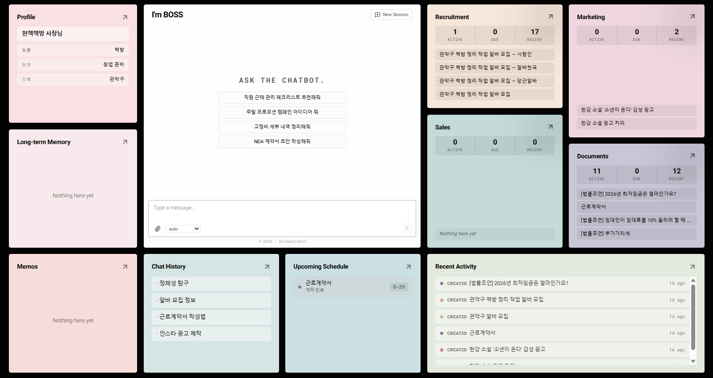

# BOSS-2




> AI 기반 소상공인 자율 운영 플랫폼. Planner 기반 오케스트레이터 챗봇 하나로 채용·마케팅·매출·서류를 자동 관리합니다.

## Overview

중앙 오케스트레이터가 사용자의 자연어 메시지를 JSON-schema 플래너로 분석해 4개 도메인(채용/마케팅/매출/서류) 에이전트의 capability 를 function-calling 으로 직접 호출합니다. 생성된 모든 작업물(artifact) 은 metadata 의 `schedule_enabled` 토글 하나로 Celery Beat 스케쥴러에 연결되어 켜두면 알아서 돌아갑니다.

```
[사용자 채팅]
      ↓
[Planner (JSON-schema)]        ← gpt-4o-mini / Anthropic Claude 선택
      ↓ dispatch / ask / chitchat / refuse / planning
[Capability Router]            ← 4개 도메인 describe() 모아 OpenAI tools 스펙 조립
      ↓ 병렬 또는 순차
채용 · 마케팅 · 매출 · 서류
      ↓
Artifact + metadata(schedule_enabled · due_date · ...)
      ↓
Celery Beat (60s tick) → 실행 / D-7·D-3·D-1·D-0 알림
```

## Architecture

| 영역      | 기술                                                                                          |
| --------- | --------------------------------------------------------------------------------------------- |
| Frontend  | Next.js 16 App Router, Tailwind CSS, Shadcn/ui (React Flow 제거됨 — Bento + Kanban)           |
| Backend   | FastAPI (Python 3.12, async 전역)                                                             |
| Database  | Supabase (PostgreSQL + pgvector + Realtime)                                                   |
| Scheduler | Celery + Upstash Redis (Celery Beat)                                                          |
| AI        | OpenAI GPT-4o (chat) · GPT-4o-mini (planner·compress) · Claude Sonnet (optional planner)      |
| Embedding | BAAI/bge-m3 (로컬, 1024dim)                                                                   |
| RAG       | pgvector + PostgreSQL FTS → RRF 하이브리드 (contract/marketing/legal 지식 베이스 총 3k+ 청크) |
| Auth      | Supabase Auth (이메일 + 비밀번호)                                                             |

## Key Features

- **Planner 기반 오케스트레이터 v1.1+ → v1.2** — `_planner.py` 가 `response_format=json_schema` 강제로 매 턴 `{mode, opening, brief, steps[], question, choices, profile_updates}` 구조화 JSON 을 생성. `dispatch` 모드는 도메인 capability 들을 `depends_on` 관계에 따라 `asyncio.gather` 로 병렬 실행. 실패 시 legacy `classify_intent` → `_call_domain_with_shortcut` 으로 자동 폴백하는 2단 세이프티넷.
- **4개 도메인 통합 Capability 라우팅 v1.2** — `_capability.V2_DOMAINS` 에 sales 가 합류해 **채용·마케팅·매출·서류 4개 도메인 전부** function-calling 으로 통일. 각 도메인이 `describe(account_id) -> list[Capability]` 를 export 하면 오케스트레이터가 OpenAI tools 스펙 + dispatch map 을 한 번에 조립.
- **Speaker 추적 v1.2** — assistant 메시지마다 어떤 에이전트(들)이 생성했는지 `chat_messages.speaker text[]` 에 기록 + `ChatResponse.data.speaker` 로 노출. 프론트 `SpeakerBadge` 가 도메인 색상 pill 로 렌더해 사용자가 "누구의 답변인지" 바로 알 수 있음.
- **Schedule → Metadata 통합 v1.2** — 기존 `kind='schedule'` 별도 노드 체계를 폐기하고 부모 artifact 의 `metadata.schedule_enabled` + `schedule_status` + `cron` + `next_run` 으로 인라인화 (020_schedule_to_metadata.sql). 칸반/상세 모달에서 "노드 → 이 artifact 는 스케쥴도 있음" 을 한 카드로 관리.
- **NodeDetailModal 통합 상세 v1.2** — `components/detail/NodeDetailContext.tsx` 가 앱 전역에 `<NodeDetailModal />` 을 한 번만 마운트. `useNodeDetail().openDetail(id)` 또는 `window.boss:open-node-detail` CustomEvent 로 어디서든 오픈. 4개 도메인 모두 단일 모달에서 처리 — 구 `SalesDetailModal` 흡수, revenue/cost 레코드 인라인 편집·삭제 포함.
- **Sales 실 데이터 v1.2** — `sales_records` + `cost_records` 테이블 신설(021/022). 매출 입력은 채팅 자연어 파싱(`[ACTION:OPEN_SALES_TABLE]` 마커 → 프론트 `SalesInputTable`) 또는 영수증 이미지 OCR(`_sales/_ocr.py`, GPT-4o vision, `type: sales|cost` 자동 분류). Excel/CSV 업로드 파서는 `_sales/_revenue.py` + `_costs.py` 가 5분 윈도 idempotent dedup 으로 중복 저장 방지.
- **Sales Stats 대시보드 v1.2** — `/api/stats/overview` (당월 매출·비용·순이익 + 전월 대비 증감률 + 일평균) · `/monthly-trend` (최근 N개월 시계열) · `/daily` (월별 일자 시리즈) · `/top-items` (기간 랭킹). `sales_records` + `cost_records` 기반 실 집계.
- **YouTube Shorts 4-step 위저드 v1.0** — `ShortsWizardCard` 로 사진 업로드 → 자막 편집 → 설정 → 생성 흐름. 인증은 `/api/marketing/youtube/oauth/*`, 자막 미리보기는 `/preview-subtitles`, 생성은 `/generate`. 결과물은 YouTube 자동 업로드 + 클라우드 스토리지 URL 이중 반환.
- **인스타그램 Meta Graph API 자동 게시 v1.0** — `/api/marketing/instagram/publish` (이미지 + 캡션 + 해시태그). DALL·E 3 이미지 생성 (`/api/marketing/image`) + 업로드된 사진 라이브러리 (`/photos`) + `PhotoLibraryModal` UI.
- **Recruitment 3종 플랫폼 공고 동시 작성 + HTML 포스터 v0.9~** — 당근알바/알바천국/사람인 세트를 `[JOB_POSTINGS]` 마커로 동시 생성 → 부모 `job_posting_set` + 자식 `job_posting × 3` + `metadata.platform`. HTML 포스터는 GPT-4o standalone HTML 로 플랫폼별 비율(1:1 / 4:5 / 3:2) 생성 후 Supabase Storage `recruitment-posters` + `artifacts.content` 이중 저장. 인건비는 `_recruit_calc.py` 에서 연도별 최저임금 + 주휴수당 + 4대보험 의무 시뮬레이션.
- **Documents 에이전트 v0.7 → v1.3** — type 11종: 기본 6종(`contract` · `estimate` · `proposal` · `notice` · `checklist` · `guide`) + Step 3-B 에서 Operations 2종 추가(`subsidy_application` 국가 지원사업 신청서 · `admin_application` 행정 처리 신청서) + Step 3-A 에서 Tax&HR 3종 추가(`hr_evaluation` 인사평가서 · `payroll_doc` 급여명세서·원천징수·4대보험 · `tax_calendar` 세무 신고 캘린더). 계약서 subtype 7종 (NDA knowledge 는 Step 3-D 에서 완성). 스켈레톤 + 한국 법령·관행 조항 markdown 이 system 프롬프트에 자동 주입. `due_label` 메타로 스케쥴러 **D-7/D-3/D-1/D-0** 알림. v1.3 에서 서브허브를 4카테고리 역할 축으로 재정의: **Review**(공정 중립 — 계약서·제안서 작성/검토, 견적서·제안서 비계약 분석도 포함) · **Tax&HR**(인사평가·급여·세무 문서, 채용 제외) · **Legal**(법률 자문) · **Operations**(견적서·공지문·국가 지원사업·행정 처리). 각 capability `describe()` 에 `[카테고리: …]` 힌트를 달아 Planner 가 4축으로 라우팅. `doc_subsidy_application` 은 `search_subsidy_programs` RAG 후보를 CHOICES 로 되물어 사용자 의도 맞춤 초안 생성 (agent 성 보강).
- **공정성 분석 v0.8** — PDF/DOCX/이미지 업로드 → 이미지는 gpt-4o vision OCR → 1,349 청크 지식 베이스(법령 1,171 + 위험패턴 100 + 허용조항 78) **3-way RRF RAG** → 갑/을 유불리 비율 + 위험 조항 JSON. `type='analysis'` artifact + `analyzed_from` 엣지, 프론트 `ReviewResultCard` 로 렌더.
- **Legal 서브브랜치 v0.9** — 다분야 법령(노동·임대차·공정거래·개인정보·세법·상법·가맹·전자상거래·식품위생 등) 16종 RAG + `legal_annual_values` 테이블 (매년 갱신되는 최저임금/세율/보험료 등 확정 수치) 연동. GPT-4o 답변 + 면책 고지 자동 첨부 → Documents > Legal 서브허브에 `legal_advice` artifact.
- **표준 서브허브 18종** — 모든 계정 가입 시 자동 부트스트랩. Recruitment 4 + Documents 4(`Review · Tax&HR · Legal · Operations` — 024 에서 `Contracts → Review` 재명명) + Sales 5(`Revenue · Costs · Pricing · Customers · Reports` — 021 에서 Revenue 추가) + Marketing 5. `ensure_standard_sub_hubs(account_id)` 가 idempotent.
- **메모리 CRUD + Boost v1.2** — `/api/memory/long/{id}` PATCH·DELETE + `/api/memory/boost` (artifact 요약을 장기 기억에 pin, importance 0.2-1.0). Long-Term Memory 모달에서 직접 편집.
- **Bento 대시보드 + Domain Kanban v1.0** — `/dashboard` 12-컬럼 Bento Grid (`ChatCenterCard` / `ProfileMemorySidebar` / 4개 `DomainCard` / `ScheduleCard` / `ActivityCard` / `PreviousChatCard`). `/[domain]` 은 서브허브를 컬럼으로 펼친 Kanban — 카드 드래그로 `artifact_edges.contains` 부모 교체.
- **Inline Chat** — `ChatCenterCard` 안에 항상 마운트. 파일 업로드(20MB), 이미지 OCR, `[CHOICES]` 버튼, `[ACTION:OPEN_SALES_TABLE]` / `[ACTION:OPEN_COST_TABLE]` 인라인 테이블, `[ACTION:OPEN_NODE_DETAIL]` 상세 모달, Markdown 렌더, `ReviewResultCard` / `InstagramPostCard` / `ReviewReplyCard` / `ShortsWizardCard` / `PhotoLibraryModal`. 빈 상태에서 도메인당 10문항 풀에서 랜덤 4개 샘플링된 제안 프롬프트.
- **로그인 브리핑** — 직전 접속 이후 자동 실행·알림·실패·오늘 추천을 헤드라인 3줄 + 상세 섹션으로 요약해 채팅창에 자동 오픈. 프로필이 비어있으면 하나씩 부드럽게 수집.
- **닉네임 + 사업 프로필 자동 학습** — Planner 가 매 턴 `profile_updates` 로 직접 추출 저장 + legacy `[SET_NICKNAME]`/`[SET_PROFILE]` 블록도 유지. 모든 도메인 에이전트 응답에 닉네임·프로필 컨텍스트 주입.
- **진짜 작동하는 Celery 스케쥴러** — Beat 60s 주기 `tick` 태스크가 `metadata.schedule_enabled=true` 인 artifact 실행 + `start_date`/`due_date` D-7·D-3·D-1·D-0 알림을 `activity_logs.schedule_notify` 로 기록. 실행 결과는 `kind='log'` artifact + `logged_from` 엣지로 자동 추가.
- **RAG + 하이브리드 서치** — pgvector 벡터 + BM25 근사 FTS, RRF 병합. artifact/memo/schedule(deprecated)/log/hub 전 범위 인덱싱.
- **전역 검색 팔레트** (`⌘K` / `Ctrl+K`) — 하이브리드 검색 결과 클릭 시 NodeDetailModal 즉시 오픈.

## Project Structure

```
BOSS-2/
├── frontend/                      # Next.js App
│   ├── app/
│   │   ├── (auth)/login/          # 이메일+비밀번호 로그인
│   │   ├── dashboard/             # Bento Grid 대시보드
│   │   ├── activity/              # Activity 라우트
│   │   ├── recruitment/           # Kanban (/[domain] 실체)
│   │   ├── marketing/
│   │   ├── sales/
│   │   ├── documents/
│   │   └── providers.tsx          # <NodeDetailProvider> 전역 래핑
│   ├── components/
│   │   ├── bento/                 # BentoGrid / ChatCenterCard / DomainCard / ScheduleCard
│   │   │                          # / ActivityCard / PreviousChatCard / ProfileMemorySidebar
│   │   │                          # / KanbanBoard·Column·Card / DomainPage
│   │   ├── chat/                  # InlineChat + ChatContext + 카드 렌더러들
│   │   │                          # (SpeakerBadge / ReviewResultCard / InstagramPostCard
│   │   │                          #  / ReviewReplyCard / ShortsWizardCard / PhotoLibraryModal
│   │   │                          #  / SalesInputTable / CostInputTable / MarkdownMessage
│   │   │                          #  / BriefingLoader)
│   │   ├── detail/                # NodeDetailContext + NodeDetailModal (v1.2 통합 상세)
│   │   ├── layout/                # Header + 대시보드 모달 6종
│   │   ├── search/                # SearchPalette (⌘K)
│   │   └── ui/                    # Modal (portal + variant) · shadcn 공통
│   └── lib/
│       ├── supabase.ts
│       └── api.ts
│
├── backend/                       # FastAPI
│   ├── app/
│   │   ├── agents/
│   │   │   ├── orchestrator.py    # Planner 주 경로 + legacy 세이프티넷 + 브리핑
│   │   │   ├── _planner.py        # JSON-schema 강제 플래너 (v1.1+)
│   │   │   ├── _capability.py     # V2_DOMAINS = 4개, describe_all()
│   │   │   ├── _speaker_context.py  # per-request 화자 ContextVar
│   │   │   ├── _upload_context.py   # per-request 업로드 payload
│   │   │   ├── _sales_context.py    # per-request 영수증/저장 payload
│   │   │   ├── recruitment.py     # 3종 플랫폼 공고 + HTML 포스터
│   │   │   ├── documents.py       # 11종 type + 계약 subtype 7 + 공정성 분석 + Legal 분기
│   │   │   │                       # 서브허브: Review / Tax&HR / Legal / Operations (v1.3)
│   │   │   │                       # v1.3 Step 3 신규 capability: subsidy_application,
│   │   │   │                       #   admin_application, hr_evaluation, payroll_doc, tax_calendar
│   │   │   ├── marketing.py       # SNS/Blog/Campaign/Shorts/리뷰 답글
│   │   │   ├── sales.py           # 8종 type, v1.2 describe() export
│   │   │   ├── _sales/            # 매출 도메인 서브패키지 (v1.2)
│   │   │   │   ├── _revenue.py    # dispatch_save_revenue (idempotent 5min)
│   │   │   │   ├── _costs.py      # dispatch_save_costs
│   │   │   │   └── _ocr.py        # parse_receipt_from_bytes (gpt-4o vision)
│   │   │   ├── _doc_templates.py  # TYPE_SPEC + SKELETONS + detect_doc_intent
│   │   │   ├── _doc_review.py     # 공정성 분석
│   │   │   ├── _doc_classify.py   # 업로드 문서 분류
│   │   │   ├── _legal.py          # 법률 자문 서브브랜치
│   │   │   ├── _recruit_calc.py
│   │   │   ├── _recruit_templates.py
│   │   │   ├── _marketing_knowledge.py
│   │   │   ├── _doc_knowledge/    # 계약 subtype 별 스켈레톤 md
│   │   │   ├── _recruit_knowledge/
│   │   │   ├── _artifact.py       # [ARTIFACT] 블록 파서 + save_artifact_from_reply
│   │   │   ├── _suggest.py        # suggest_today_for_domain
│   │   │   └── _feedback.py       # up/down-vote 피드백 주입
│   │   ├── core/
│   │   │   ├── config.py          # Settings (env)
│   │   │   ├── llm.py             # chat_completion + planner_completion (OpenAI/Claude)
│   │   │   ├── embedder.py        # BAAI/bge-m3
│   │   │   ├── doc_parser.py      # PDF/DOCX/TXT/RTF/XLSX/CSV
│   │   │   ├── ocr.py             # gpt-4o vision
│   │   │   ├── poster_gen.py      # 채용 공고 HTML 포스터
│   │   │   ├── redis.py
│   │   │   └── supabase.py
│   │   ├── memory/                # sessions / short_term / long_term / compressor
│   │   ├── rag/                   # embedder 래퍼 + hybrid_search
│   │   ├── scheduler/             # Celery app / tick / scanner / log_nodes
│   │   ├── routers/               # API (아래 표 참고)
│   │   ├── models/                # Pydantic 스키마
│   │   └── main.py
│   ├── scripts/
│   │   ├── backfill_embeddings.py
│   │   ├── ingest_contract_laws.py
│   │   ├── ingest_contract_risks.py
│   │   ├── ingest_contract_acceptable.py
│   │   ├── ingest_legal_knowledge.py
│   │   └── ingest_marketing_knowledge.py
│   ├── celeryconfig.py
│   └── requirements.txt
│
├── supabase/
│   ├── migrations/                # 001 ~ 023 (아래 목록 참고)
│   └── seed/                      # mock 데이터 + cleanup
│
├── .gitignore
├── .gitattributes
├── CHANGELOG.md
├── CLAUDE.md
└── README.md
```

## Backend API 요약

Router mount 순서 (`backend/app/main.py`):
`auth → chat → activity → evaluations → schedules → artifacts → summary → dashboard → kanban → marketing → memory → memos → recruitment → search → uploads → reviews → costs → sales → stats`.

| prefix             | 주요 엔드포인트                                                                                                                                                  |
| ------------------ | ---------------------------------------------------------------------------------------------------------------------------------------------------------------- |
| `/api/auth`        | `POST /session/touch` (로그인 브리핑 트리거)                                                                                                                     |
| `/api/chat`        | `POST /` · `GET,POST /sessions` · `GET /sessions/{id}/messages` · `PATCH,DELETE /sessions/{id}`                                                                  |
| `/api/activity`    | `GET /` (활동 로그 페이지네이션)                                                                                                                                 |
| `/api/evaluations` | `POST /` (up/down 평가 + 메모리 반영)                                                                                                                            |
| `/api/schedules`   | `POST /` · `PATCH /{id}` · `POST /{id}/run-now` · `GET /{id}/history` · `PATCH /{id}/status`                                                                     |
| `/api/artifacts`   | `DELETE /{id}` · `PATCH /{id}` · `PATCH /{id}/pin` · `GET /{id}/detail`                                                                                          |
| `/api/summary`     | `POST /` (30일 활동 요약)                                                                                                                                        |
| `/api/dashboard`   | `GET /summary?account_id=`                                                                                                                                       |
| `/api/kanban`      | `GET /{domain}?account_id=` · `PATCH /move`                                                                                                                      |
| `/api/marketing`   | `POST /image` · `POST /blog/upload` · `POST /review/analyze` · `POST /instagram/publish` · `GET,POST,DELETE /photos` · YouTube OAuth + Shorts · `GET /subsidies` |
| `/api/memory`      | `PATCH,DELETE /long/{id}` · `POST /boost` (v1.2+)                                                                                                                |
| `/api/memos`       | `GET,POST /` · `PATCH,DELETE /{id}`                                                                                                                              |
| `/api/recruitment` | `POST /poster` · `POST /wage-simulation`                                                                                                                         |
| `/api/search`      | `GET /?q=` (하이브리드)                                                                                                                                          |
| `/api/uploads`     | `POST /document` (multi-file, 20MB) · `PATCH /document/{id}/classification` (legacy no-op)                                                                       |
| `/api/reviews`     | `POST /` (계약서 공정성 분석)                                                                                                                                    |
| `/api/costs`       | `POST,GET /` · `GET /summary` · `PATCH,DELETE /{id}`                                                                                                             |
| `/api/sales`       | `POST,GET /` · `GET /summary` · `PATCH,DELETE /{id}`                                                                                                             |
| `/api/stats`       | `GET /overview` · `GET /monthly-trend` · `GET /daily` · `GET /top-items`                                                                                         |

## Getting Started

### 1. 환경 변수 설정

```bash
cp backend/.env.example backend/.env
cp frontend/.env.example frontend/.env.local
# 값 입력 — Supabase URL/key, OpenAI key, Upstash Redis, (선택) Anthropic key, Meta/YouTube OAuth 등
```

### 2. Supabase 설정

```bash
# supabase/migrations/*.sql 을 Supabase MCP 또는 SQL Editor 에서 순서대로 실행
#   001_extensions.sql                         pgcrypto, uuid-ossp, vector, pg_trgm
#   002_schema.sql                             기본 테이블 (chat_messages/chat_sessions 포함)
#   003_indexes.sql                            ivfflat / GIN / btree
#   004_rls.sql                                RLS
#   005_functions_triggers.sql                 bootstrap_workspace, hybrid_search, memory_search
#   006_expand_embeddings_source_type.sql      schedule/log/hub source_type + upsert_embedding RPC
#   007_memos.sql                              memos + 'memo' source_type
#   008_expand_activity_log_types.sql          schedule_run / schedule_notify
#   009_profile_last_seen.sql                  profiles.last_seen_at
#   010_profile_expansion.sql                  profiles core 7 필드 + profile_meta
#   011_contract_knowledge.sql                 계약서 RAG 테이블 3종
#   012_contract_knowledge_search.sql          3-way RRF RPC
#   013_artifact_edges_analyzed_from.sql       analyzed_from relation
#   014_standard_sub_hubs.sql                  17종 표준 서브허브
#   015_marketing_knowledge.sql                marketing 지식 테이블
#   016_marketing_rag.sql                      marketing 하이브리드 검색 RPC
#   017_marketing_subhubs.sql                  marketing 서브허브 확장
#   018_legal_knowledge.sql                    legal_knowledge_chunks
#   019_legal_knowledge_search.sql             search_legal_knowledge RPC
#   020_legal_annual_values.sql                연도별 법정 수치
#   020_schedule_to_metadata.sql               schedule 노드 → metadata 인라인 (kind CHECK 갱신)
#   021_sales_records.sql                      sales_records + Revenue 서브허브 추가 → 18종
#   022_cost_records.sql                       cost_records
#   023_chat_messages_speaker.sql              chat_messages.speaker text[]
#   024_rename_contracts_to_review.sql         Documents 서브허브 Contracts → Review 재명명
#
# (선택) mock 데이터 — 020 이후로 schedule 노드 포함 시드는 재작성 필요
#   supabase/seed/seed_mock_data.sql
#   supabase/seed/cleanup_mock_data.sql
#
# (선택) 임베딩 백필 — 기존 artifact/memo/log 에 한 번
#   cd backend && python scripts/backfill_embeddings.py
#
# (선택) 지식 베이스 인제스트 — 011/012/015/016/018/019 적용 후 1회
#   cd backend
#   python scripts/ingest_contract_risks.py
#   python scripts/ingest_contract_acceptable.py
#   python scripts/ingest_contract_laws.py
#   python scripts/ingest_marketing_knowledge.py
#   python scripts/ingest_legal_knowledge.py
```

### 3. Backend 실행

```bash
cd backend
conda create -n boss2 python=3.12
conda activate boss2
uv pip install -r requirements.txt

# FastAPI
uvicorn app.main:app --reload --port 8000

# Celery Worker (별도 터미널)
celery -A app.scheduler.celery_app worker --loglevel=info

# Celery Beat (별도 터미널)
celery -A app.scheduler.celery_app beat --loglevel=info
```

### 4. Frontend 실행

```bash
cd frontend
npm install
npm run dev
```

## Available Slash Commands (Claude Code)

| 커맨드             | 설명                              |
| ------------------ | --------------------------------- |
| `/forge-agent`     | Agent 로직 개발/디버그            |
| `/forge-scheduler` | Celery 태스크 관리                |
| `/forge-rag`       | RAG 파이프라인 설정/디버그        |
| `/forge-schema`    | Supabase 스키마/마이그레이션 생성 |
| `/forge-memory`    | 계정별 장기 기억 관리             |
| `/forge-context`   | Context 압축 로직                 |

## Version

현재 버전: **1.2.0** — 자세한 변경 내역은 [CHANGELOG.md](./CHANGELOG.md) 참고.

## Branch Policy

- **default branch: `dev`** — 모든 feature 브랜치는 `dev` 로 PR.
- `main` 은 릴리스 스냅샷 용도.
