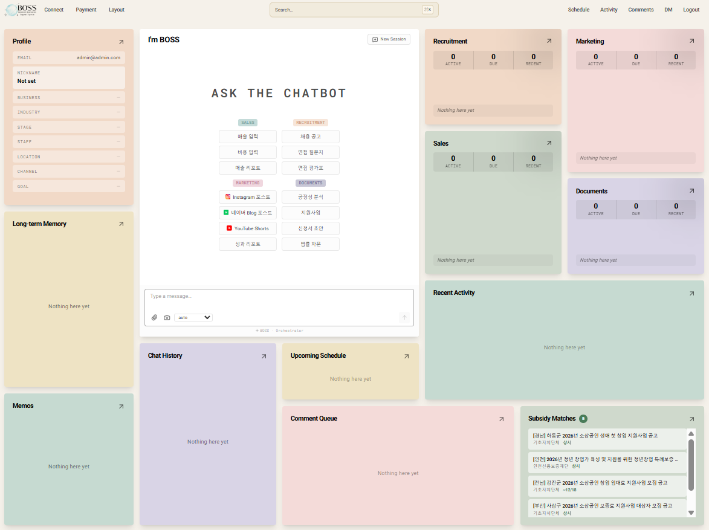
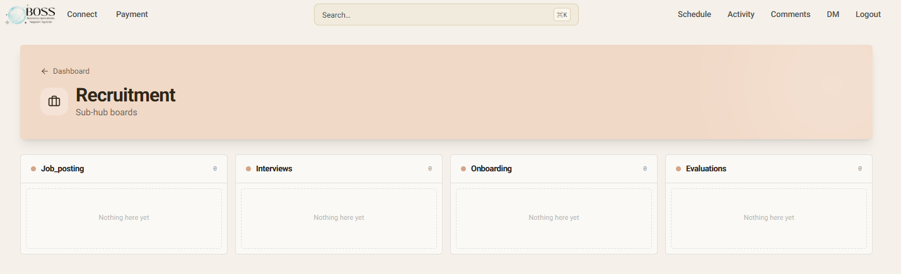

# BOSS-2


> AI 기반 소상공인 자율 운영 플랫폼. 채팅 하나로 채용·마케팅·매출·서류를 자동 관리합니다.





## Overview

중앙 Planner가 자연어 메시지를 JSON-schema로 분석해 4개 도메인 에이전트(채용/마케팅/매출/서류)의 capability를 function-calling으로 직접 호출합니다. 생성된 모든 artifact는 `metadata.schedule_enabled` 토글 하나로 Celery Beat 스케줄러에 연결되어 자율 실행됩니다.

```
[사용자 채팅]
      ↓
[Planner (JSON-schema)]        ← GPT-4o / Claude Sonnet 선택
      ↓ dispatch / ask / chitchat / refuse
[Capability Router]            ← 4개 도메인 describe() → OpenAI tools 스펙 자동 조립
      ↓ 병렬(asyncio.gather) 또는 순차(depends_on)
채용 · 마케팅 · 매출 · 서류
      ↓
Artifact + metadata (schedule_enabled · cron · next_run · due_date)
      ↓
Celery Beat (60s tick) → 자율 실행 / D-7·D-3·D-1·D-0 알림
```

## Architecture

| 영역      | 기술                                                                                 |
| --------- | ------------------------------------------------------------------------------------ |
| Frontend  | Next.js 16 App Router, Tailwind CSS v4, shadcn/ui, React 19                          |
| Backend   | FastAPI (Python 3.12, async 전역)                                                    |
| Database  | Supabase (PostgreSQL + pgvector + Realtime)                                          |
| Scheduler | Celery 5 + Upstash Redis (Celery Beat, KST)                                          |
| AI        | OpenAI GPT-4o (chat) · GPT-4o-mini (compress) · Claude Sonnet 4.6 (optional planner) |
| Embedding | BAAI/bge-m3 (로컬, 1024-dim)                                                         |
| RAG       | pgvector + PostgreSQL FTS → RRF 하이브리드 (계약·마케팅·법률 지식베이스 3k+ 청크)    |
| Auth      | Supabase Auth (이메일 + 비밀번호)                                                    |

## Key Features

### 오케스트레이터 & Planner

- **Planner 기반 오케스트레이터** — `_planner.py`가 `response_format=json_schema` 강제로 `{mode, opening, brief, steps[], question, choices, profile_updates}` 구조화 JSON 생성. `dispatch` 모드는 `depends_on` 관계에 따라 병렬 실행
- **pending_save 강제 override** — `SalesInputTable` / `CostInputTable` 에서 저장 요청 시 Planner 모드와 무관하게 `sales_save_revenue` / `sales_save_costs`로 강제 dispatch
- **upload_hint override** — 파일 업로드 첨부 시 `recruit_resume_parse`로 자동 라우팅
- **프로필 넛지** — 7개 핵심 필드 중 3개 미만 입력 시 매 턴 STRONG 지시 주입으로 프로필 수집
- **로그인 브리핑** — 8시간 이상 미접속·스케줄 실패 시 활동 요약 + 도메인 제안 자동 생성

### 채용 (Recruitment)

- 당근알바 / 알바천국 / 사람인 3종 플랫폼 공고 동시 생성 (`[JOB_POSTINGS]` 마커)
- GPT-4o standalone HTML 포스터 (플랫폼별 비율 1:1 / 4:5 / 3:2) → Supabase Storage + iframe 미리보기
- 면접 질문지 (이력서 바탕 맞춤 생성) + 면접 평가표 + DOCX 내보내기
- 인건비 시뮬레이션 — 최저임금 + 주휴수당 + 4대보험 자동 계산

### 마케팅 (Marketing)

- **Instagram** — Meta Graph API 자동 게시, DALL·E 3 이미지 생성, 사진 라이브러리 관리
- **네이버 Blog** — 포스트 초안 생성 및 업로드
- **YouTube Shorts** — 4-step 위저드 (사진 업로드 → 자막 편집 → 설정 → 생성·업로드)
- **이벤트 포스터** — GPT-4o A4 standalone HTML 생성, `EventPlanFormCard` 연계 dispatch
- **자동화 스케줄 폼** — `ScheduleFormCard`에서 cron 5-field 자동 생성
- **리뷰 답글** — 리뷰 캡처 이미지 OCR 후 플랫폼·별점 자동 인식, 답글 초안 생성
- **성과 리포트** — Instagram·YouTube 인사이트 수집 + AI 분석

### 매출 (Sales)

- **매출/비용 입력** — 자연어 파싱 + `SalesInputTable` / `CostInputTable` 인라인 테이블
- **영수증 OCR** — GPT-4o vision으로 type(sales/cost) 자동 분류
- **Excel/CSV 업로드** — 5분 윈도 idempotent dedup으로 중복 방지
- **POS 연동** — Square POS 연동 지원
- **통계 대시보드** — 월간/일일 트렌드, 상위 항목 랭킹 (`/api/stats/`)
- **메뉴 관리 + 수익성 분석** — 메뉴별 원가·마진 분석
- **고객 스크립트 / 고객 분석 / 프로모션** — 각 capability별 artifact 저장

### 서류 (Documents)

- **공정성 분석** — PDF/DOCX/이미지 업로드 → 3-way RRF RAG (법령 1,171 + 위험패턴 100 + 허용조항 78 청크) → 갑/을 유불리 + 위험 조항 JSON, `ReviewResultCard` 렌더링
- **법률 자문** — 16종 다분야 법령 RAG + `legal_annual_values` (매년 최저임금·세율·보험료) 연동
- **계약서** 7종 subtype (NDA / 노동 / 임대차 / 파트너십 / 프랜차이즈 / 서비스 / 공급)
- **급여명세서** — 2-턴 플로우 (직원 선택 → 월 선택), `WorkTableCard` 인라인 근무 기록 편집
- **지원사업 신청서** — `search_subsidy_programs` RAG 후보 CHOICES로 맞춤 초안 생성
- **행정 신청서** — 행정 처리 서류 자동 초안
- **문서 타입 11종** — contract · estimate · proposal · notice · checklist · guide · subsidy_application · admin_application · hr_evaluation · payroll_doc · tax_calendar

### 어드민 (Admin)

- **`is_admin` 접근 제어** — `profiles.is_admin = true` 계정에만 `/admin` 페이지 접근 허용. `require_admin` FastAPI 의존성으로 서버 측 가드.
- **전역 AdminFab** — 어드민 계정 로그인 시 우하단에 FAB 버튼 노출, `/admin`으로 이동.
- **유저 탭** — 전체 가입자 목록 + 계정별 활성 스케줄 수 조회.
- **결제 탭** — 구독 플랜·결제 내역 전체 조회.
- **통계 탭** — 플랫폼 전체 artifact 수·도메인별 breakdown·매출/비용 합계.
- **LLM 코스트 탭** — Langsmith API 연동, 계정별 토큰 사용량·비용 집계.
- **Roboto 폰트 + 전용 디자인 시스템** — 어드민 전용 typography, border-radius 5px, 대형 폰트.

### 메모리 & RAG

- **단기 메모리** — Upstash Redis, 20턴 초과 시 GPT-4o-mini 자동 압축
- **장기 메모리** — Supabase pgvector, 도메인×일자 digest + RRF + importance, 7일 TTL
- **RAG 하이브리드** — pgvector 벡터 + BM25 근사 FTS → RRF 병합

### 스케줄러

- **Celery Beat 60s tick** — `metadata.schedule_enabled=true` artifact 자동 실행
- **D-7 · D-3 · D-1 · D-0 알림** — `activity_logs.schedule_notify`에 기록
- **실행 결과** — `kind='log'` artifact + `logged_from` 엣지로 자동 추가

### Frontend UI

- **Bento Grid 대시보드** — 12-컬럼 (`ChatCenterCard` / `ProfileMemorySidebar` / 4개 `DomainCard` / `ScheduleCard` / `ActivityCard` / `PreviousChatCard`)
- **Domain Kanban** — 서브허브를 컬럼으로 펼친 드래그 가능 Kanban 보드
- **NodeDetailModal 통합 상세** — 전역 단일 마운트, 4개 도메인 모두 처리
- **초기화면 퀵액션 그리드** — 2×2 도메인 그리드, 도메인당 핵심 버튼 세로 정렬
- **전역 검색 팔레트** — `⌘K` / `Ctrl+K` 하이브리드 검색 → NodeDetailModal 즉시 오픈
- **채팅 아바타** — 부장님/직원 SVG + 커스텀 사진 업로드 (Supabase Storage `avatars/`)
- **정부 지원사업** — `SubsidyMatchCard` Bento 카드 + 프로필 맞춤 24h 캐싱 추천

## Project Structure

```
BOSS-2/
├── frontend/                        # Next.js 16 App Router
│   ├── app/
│   │   ├── (auth)/login/            # 로그인
│   │   ├── (auth)/signup/           # 회원가입
│   │   ├── dashboard/               # Bento Grid
│   │   ├── activity/                # 활동 로그
│   │   ├── recruitment/             # 채용 Kanban
│   │   ├── marketing/               # 마케팅 Kanban
│   │   ├── sales/                   # 매출 Kanban
│   │   ├── documents/               # 서류 Kanban
│   │   ├── admin/                   # 어드민 페이지 (탭 4개)
│   │   └── providers.tsx            # ChatProvider + NodeDetailProvider + AdminFab
│   ├── components/
│   │   ├── bento/                   # BentoGrid · ChatCenterCard · DomainCard
│   │   │                            # KanbanBoard · ProfileMemorySidebar · ScheduleCard
│   │   ├── chat/                    # InlineChat · ChatContext · 카드 렌더러 20+종
│   │   ├── detail/                  # NodeDetailContext + NodeDetailModal
│   │   ├── employees/               # 직원 관리 UI
│   │   ├── layout/                  # Header + 모달 6종 + AdminFab
│   │   ├── sales/                   # 매출 전용 컴포넌트
│   │   ├── search/                  # SearchPalette (⌘K)
│   │   └── ui/                      # shadcn/ui + Modal
│   └── lib/
│       ├── supabase.ts
│       └── api.ts
│
├── backend/
│   ├── app/
│   │   ├── agents/
│   │   │   ├── orchestrator.py      # 메인 오케스트레이터 + 브리핑
│   │   │   ├── _planner.py          # JSON-schema 강제 플래너
│   │   │   ├── _capability.py       # describe_all() → tools 스펙 + dispatch 맵
│   │   │   ├── _agent_context.py    # ContextVar 주입/접근
│   │   │   ├── _sales_context.py    # pending_save ContextVar
│   │   │   ├── _upload_context.py   # 업로드 payload ContextVar
│   │   │   ├── _speaker_context.py  # 화자 ContextVar
│   │   │   ├── recruitment.py       # 채용 도메인
│   │   │   ├── marketing.py         # 마케팅 도메인
│   │   │   ├── sales.py             # 매출 도메인
│   │   │   ├── documents.py         # 서류 도메인
│   │   │   ├── _sales/              # 매출 서브패키지 (_revenue · _costs · _ocr 등)
│   │   │   ├── _doc_knowledge/      # 계약서 subtype별 지식 (7종)
│   │   │   ├── _recruit_knowledge/  # 채용 공고 지식
│   │   │   ├── _admin_knowledge/    # 행정 처리 지식
│   │   │   └── _tax_hr_knowledge/   # 세무/HR 지식
│   │   ├── core/
│   │   │   ├── config.py            # Settings (env)
│   │   │   ├── llm.py               # chat_completion + planner_completion
│   │   │   ├── embedder.py          # BAAI/bge-m3 (1024-dim)
│   │   │   ├── doc_parser.py        # PDF/DOCX/TXT/RTF/XLSX/CSV
│   │   │   ├── ocr.py               # GPT-4o vision OCR
│   │   │   ├── poster_gen.py        # 채용 공고 HTML 포스터
│   │   │   └── event_poster_gen.py  # 이벤트 포스터
│   │   ├── memory/                  # short_term · long_term · compressor · sessions
│   │   ├── rag/                     # 하이브리드 검색 래퍼
│   │   ├── scheduler/               # Celery app · tick · scanner · log_nodes
│   │   ├── routers/                 # FastAPI 라우터 29개
│   │   ├── models/                  # Pydantic 스키마
│   │   └── main.py
│   ├── scripts/                     # 지식베이스 인제스트 + 임베딩 백필
│   └── requirements.txt
│
├── supabase/
│   ├── migrations/                  # 001 ~ 037 (아래 참고)
│   └── seed/
│
├── CHANGELOG.md
├── CLAUDE.md
└── README.md
```

## Backend API

Router mount 순서: `auth → chat → integrations → payment → comments → dm_campaigns → activity → evaluations → schedules → artifacts → summary → dashboard → kanban → marketing → memory → memos → recruitment → search → uploads → reviews → costs → menus → pos → sales → subsidies → stats → employees → work_records → docx`

| prefix             | 주요 엔드포인트                                                                                 |
| ------------------ | ----------------------------------------------------------------------------------------------- |
| `/api/auth`        | `POST /session/touch`                                                                           |
| `/api/chat`        | `POST /` · `GET,POST /sessions` · `GET /sessions/{id}/messages` · `PATCH,DELETE /sessions/{id}` |
| `/api/activity`    | `GET /`                                                                                         |
| `/api/evaluations` | `POST /` (up/down 평가 + 메모리 반영)                                                           |
| `/api/schedules`   | `POST /` · `PATCH /{id}` · `POST /{id}/run-now` · `GET /{id}/history`                           |
| `/api/artifacts`   | `DELETE /{id}` · `PATCH /{id}` · `PATCH /{id}/pin` · `GET /{id}/detail`                         |
| `/api/kanban`      | `GET /{domain}` · `PATCH /move`                                                                 |
| `/api/marketing`   | `POST /image` · `POST /instagram/publish` · `GET,POST,DELETE /photos` · YouTube OAuth + Shorts  |
| `/api/memory`      | `PATCH,DELETE /long/{id}` · `POST /boost`                                                       |
| `/api/memos`       | `GET,POST /` · `PATCH,DELETE /{id}`                                                             |
| `/api/recruitment` | `POST /poster` · `POST /wage-simulation`                                                        |
| `/api/search`      | `GET /?q=` (하이브리드 검색)                                                                    |
| `/api/uploads`     | `POST /document` (multi-file, 20MB)                                                             |
| `/api/reviews`     | `POST /` (공정성 분석)                                                                          |
| `/api/costs`       | `POST,GET /` · `GET /summary` · `PATCH,DELETE /{id}`                                            |
| `/api/sales`       | `POST,GET /` · `GET /summary` · `PATCH,DELETE /{id}`                                            |
| `/api/stats`       | `GET /overview` · `GET /monthly-trend` · `GET /daily` · `GET /top-items`                        |
| `/api/subsidies`   | `GET /` · `GET /recommend`                                                                      |
| `/api/employees`   | `GET,POST /` · `PATCH,DELETE /{id}`                                                             |
| `/api/docx`        | `POST /` (DOCX 생성 + Storage 업로드)                                                           |

## Supabase Migrations

`supabase/migrations/` — 파일명 알파벳 순으로 실행 (번호 중복 파일 주의):

```
001_extensions.sql                   pgcrypto, uuid-ossp, vector, pg_trgm
002_schema.sql                       기본 테이블
003_indexes.sql                      ivfflat / GIN / btree
004_rls.sql                          RLS 정책
005_functions_triggers.sql           bootstrap_workspace, hybrid_search, memory_search
006 ~ 010                            embeddings 확장 · memos · profile 필드
011_contract_knowledge.sql           계약서 RAG 테이블
012_contract_knowledge_search.sql    3-way RRF RPC
013 ~ 014                            artifact edges · 표준 서브허브 18종
015_marketing_knowledge.sql
016_marketing_rag.sql
017_marketing_subhubs.sql
018_legal_knowledge.sql
019_legal_knowledge_search.sql
020_legal_annual_values.sql          연도별 법정 수치
020_schedule_to_metadata.sql         schedule 노드 → metadata 인라인화
021_sales_records.sql
022_cost_records.sql
023_chat_messages_speaker.sql
024_comment_queue.sql
024_rename_contracts_to_review.sql
025_memory_long_rrf_digest.sql
026_instagram_dm_campaigns.sql
026_subsidy_forms.sql
027_search_subsidy_programs.sql
028_subsidy_cache.sql
029_employee_management.sql
029_menus.sql
030_dashboard_layouts.sql
030_sales_timeslot.sql
031_profile_avatar.sql
032_avatars_storage_rls.sql
033_sales_records_source_pos.sql
034_platform_credentials.sql
034_tax_knowledge.sql
035_match_sales_embeddings.sql
035_resumes_table.sql
036_resumes_rls.sql
037_fix_upsert_memory_long.sql
```

지식베이스 인제스트 (011/012/015/016/018/019 적용 후 1회):

```bash
cd backend
python scripts/ingest_contract_risks.py
python scripts/ingest_contract_acceptable.py
python scripts/ingest_contract_laws.py
python scripts/ingest_marketing_knowledge.py
python scripts/ingest_legal_knowledge.py
```

## Getting Started

### 1. 환경 변수

```bash
cp backend/.env.example backend/.env
cp frontend/.env.example frontend/.env.local
```

필수 값: `SUPABASE_URL` · `SUPABASE_SERVICE_KEY` · `OPENAI_API_KEY` · `UPSTASH_REDIS_REST_URL` · `UPSTASH_REDIS_REST_TOKEN`

선택 값: `ANTHROPIC_API_KEY` · `META_ACCESS_TOKEN` · `YOUTUBE_CLIENT_ID/SECRET` · `NAVER_BLOG_ID/PW` · `SQUARE_APP_ID`

### 2. Backend

```bash
cd backend
conda create -n boss2 python=3.12 && conda activate boss2
uv pip install -r requirements.txt

# FastAPI
uvicorn app.main:app --reload --port 8000

# Celery Worker (별도 터미널)
celery -A app.scheduler.celery_app worker --loglevel=info

# Celery Beat (별도 터미널)
celery -A app.scheduler.celery_app beat --loglevel=info
```

### 3. Frontend

```bash
cd frontend
npm install
npm run dev     # http://localhost:3000
```

## Special Markers (Backend ↔ Frontend)

| 마커                               | 설명                      |
| ---------------------------------- | ------------------------- |
| `[CHOICES]`                        | 선택지 버튼 렌더링        |
| `[ACTION:OPEN_SALES_TABLE]`        | 매출 입력 테이블 오픈     |
| `[ACTION:OPEN_COST_TABLE]`         | 비용 입력 테이블 오픈     |
| `[ACTION:OPEN_NODE_DETAIL]`        | NodeDetailModal 오픈      |
| `[[ONBOARDING_FORM]]`              | 프로필 온보딩 폼 렌더링   |
| `[ARTIFACT]`                       | artifact 블록 파싱        |
| `[JOB_POSTINGS]`                   | 채용 공고 카드 (탭 토글)  |
| `[SET_NICKNAME]` / `[SET_PROFILE]` | 프로필 저장 마커          |
| `[[EVENT_POSTER]]`                 | 이벤트 포스터 iframe 카드 |

## Claude Code Slash Commands

| 커맨드             | 설명                              |
| ------------------ | --------------------------------- |
| `/forge-agent`     | Agent 로직 개발/디버그            |
| `/forge-scheduler` | Celery 태스크 관리                |
| `/forge-rag`       | RAG 파이프라인 설정/디버그        |
| `/forge-schema`    | Supabase 스키마/마이그레이션 생성 |
| `/forge-memory`    | 계정별 장기 기억 관리             |
| `/forge-context`   | Context 압축 로직                 |

## Branch Policy

- **`dev`** — 모든 feature 브랜치의 PR 대상
- **`main`** — 릴리스 스냅샷

자세한 변경 내역은 [CHANGELOG.md](./CHANGELOG.md) 참고.
